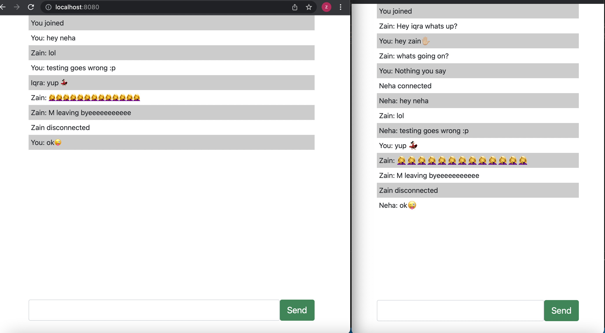

# ChatApp
Type of Challenge: `Learning`
- Duration: `2 days`
- Solo challenge

## Learning Objectives

- Set up a node environment :heavy_check_mark:
- Make a connection between different clients and the servers :heavy_check_mark:
- Work with sockets :heavy_check_mark:
- Configure express and socket.io for node :heavy_check_mark:
- Made a basic chatroom :heavy_check_mark:
- Had connected and disconnected features
- send message using name that was really challenging for me i had to work extra hours to complete this project.

 
